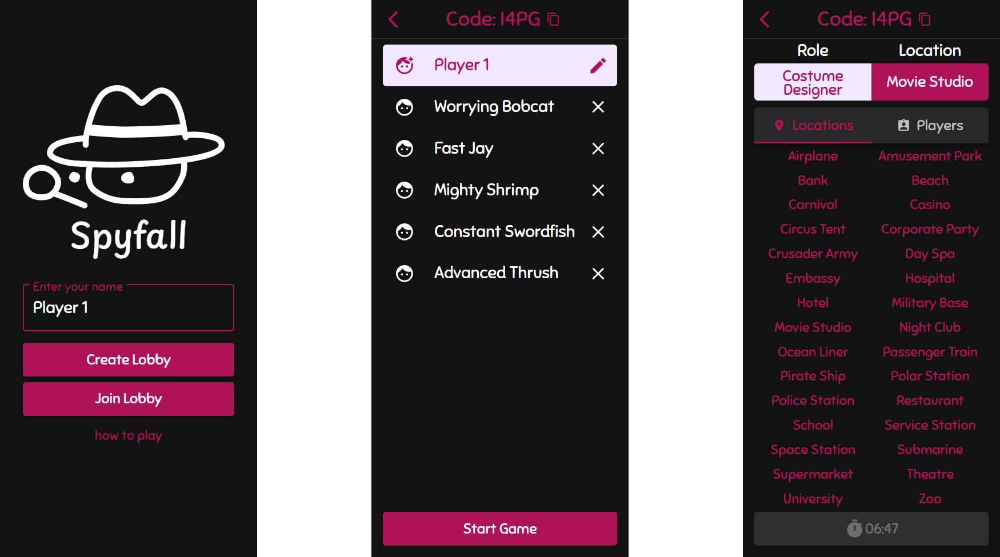

# [spyfall.playdat.es](https://spyfall.playdat.es)

An open-source web-based implementation of the popular social deduction game Spyfall. Players are assigned to a location where everyone has a specific role — except for the spy, who must figure out where they are by asking questions and blending in.

## Gameplay

- Create a lobby and invite up to 7 other players
- The lobby leader can start the game with 3-8 players
- One player is chosen at random to be the spy
- A random location is chosen and revealed to all other players
- Other players also receive a role appropriate to that location
- Players take turns asking each other questions
- The spy wins by correctly guessing the location
- Other players win by voting out the spy

## Technical Details
Build and run instructions available in the respective subdirectories
- **React 18** (Node 22)
  - Vite 
  - Material UI v5
- **FastAPI** (Python 3.10)
  - uv
- **MongoDB** (with Beanie)
